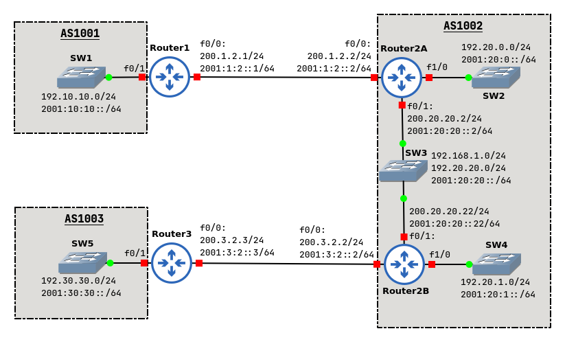

# MPBGP Guide



## Router1

```
configure terminal

ipv6 unicast-routing

interface f0/0
ip address 200.1.2.1 255.255.255.0
ipv6 address 2001:1:2::1/64
no shutdown

interface f0/1
ip address 192.10.10.1 255.255.255.0
ipv6 address 2001:10:10::1/64
no shutdown
```

#### BGP - IPv4 Only

```
router bgp 1001
neighbor 200.1.2.2 remote-as 1002
network 192.10.10.0
```

#### BGP - IPv4 and IPv6

```
no router bgp 1001
router bgp 1001
address-family ipv4 unicast
neighbor 200.1.2.2 remote-as 1002
network 192.10.10.0
address-family ipv6 unicast
neighbor 2001:1:2::2 remote-as 1002
network 2001:10:10::/64
```

## Router2A

```
configure terminal

ipv6 unicast-routing

interface f0/0
ip address 200.1.2.2 255.255.255.0
ipv6 address 2001:1:2::2/64
no shutdown

interface f0/1
ip address 200.20.20.2 255.255.255.0
ip address 192.168.1.2 255.255.255.0 secondary
ipv6 address 2001:20:20::2/64
ip ospf 1 area 0
ipv6 ospf 1 area 0
no shutdown

interface f1/0
ip address 192.20.0.1 255.255.255.0
ipv6 address 2001:20:0::1/64
no shutdown
```

#### BGP - IPv4 Only

```
router bgp 1002
neighbor 200.1.2.1 remote-as 1001
neighbor 200.20.20.22 remote-as 1002
neighbor 200.20.20.22 next-hop-self
aggregate-address 192.20.0.0 255.255.254.0 summary-only
redistribute ospf 1
network 192.20.0.0
```

#### BGP - IPv4 and IPv6

```
no router bgp 1002
router bgp 1002
address-family ipv4 unicast
neighbor 200.1.2.1 remote-as 1001
neighbor 200.20.20.22 remote-as 1002
neighbor 200.20.20.22 next-hop-self
redistribute ospf 1
network 192.20.0.0
address-family ipv6 unicast
neighbor 2001:1:2::1 remote-as 1001
neighbor 2001:20:20::22 remote-as 1002
neighbor 2001:20:20::22 next-hop-self
redistribute ospf 1
network 2001:20:0::/64
network 2001:20:20::/64
```

## Router2B

```
configure terminal

ipv6 unicast-routing

interface f0/0
ip address 200.3.2.2 255.255.255.0
ipv6 address 2001:3:2::2/64
no shutdown

interface f0/1
ip address 200.20.20.22 255.255.255.0
ip address 192.168.1.22 255.255.255.0 secondary
ipv6 address 2001:20:20::22/64
ip ospf 1 area 0
ipv6 ospf 1 area 0
no shutdown

interface f1/0
ip address 192.20.1.1 255.255.255.0
ipv6 address 2001:20:1::1/64
ip ospf 1 area 0
ipv6 ospf 1 area 0
no shutdown
```

#### BGP - IPv4 Only

```
router bgp 1002
neighbor 200.3.2.3 remote-as 1003
neighbor 200.20.20.2 remote-as 1002
neighbor 200.20.20.2 next-hop-self
redistribute ospf 1
aggregate-address 192.20.0.0 255.255.254.0 summary-only
```

#### BGP - IPv4 and IPv6

```
no router bgp 1002
router bgp 1002
address-family ipv4 unicast
neighbor 200.3.2.3 remote-as 1003
neighbor 200.20.20.2 remote-as 1002
neighbor 200.20.20.2 next-hop-self
redistribute ospf 1
address-family ipv6 unicast
neighbor 2001:3:2::3 remote-as 1003
neighbor 2001:20:20::2 remote-as 1002
neighbor 2001:20:20::2 next-hop-self
redistribute ospf 1
network 2001:20:1::/64
network 2001:20:20::/64
```

## Router3

```
configure terminal

ipv6 unicast-routing

interface f0/0
ip address 200.3.2.3 255.255.255.0
ipv6 address 2001:3:2::3/64
no shutdown

interface f0/1
ip address 192.30.30.1 255.255.255.0
ipv6 address 2001:30:30::/64
no shutdown
```

#### BGP - IPv4 Only

```
router bgp 1003
neighbor 200.3.2.2 remote-as 1002
network 192.30.30.0
```

#### BGP - IPv4 and IPv6
```
no router bgp 1003
router bgp 1003
address-family ipv4 unicast
neighbor 200.3.2.2 remote-as 1002
network 192.30.30.0
address-family ipv6 unicast
neighbor 2001:3:2::2 remote-as 1002
network 2001:30:30::/64
```

## Questions

- 7.b. Identify the main disadvantage of network aggregates.

Network aggregate is announced, but there might not be any networks to be announced at all.
